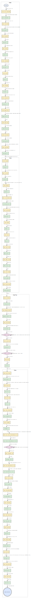

# Space Quest 1 2.2 Playthrough Analysis

This chapter is a clean-room, static-data reconstruction of a maximum-score
winning route for the local `games/SQ1.22` evidence set. It uses the canonical
resources, `WORDS.TOK`, `OBJECT`, the locally inferred interpreter behavior,
and rendered visual and priority/control channels. It does not use an external
walkthrough.

The reusable source of truth is
[`sq1_22_success_path.json`](sq1_22_success_path.json). Each selected
point-scoring action is a `score_action` node, its state conjunction is a
separate `precondition` node, and player movement, parser input, waiting, and
automatic transitions are edges. The JSON contains all 45 selected awards and
validates to 202 points.



Regenerate the graph with:

```bash
python3 -B tools/render_playthrough_graph.py \
  docs/src/games/sq1_22_success_path.json \
  --output docs/src/games/sq1_22_success_path.svg
```

## Evidence and interpretation

The game uses interpreter 2.917. Its resources contain 101 present logics, 73
pictures, 238 views, and 50 sounds. Logic 104 sets the maximum score to 202.
The route was reconstructed from full logic disassembly rather than only the
enclosing condition ranges emitted by `tools/logic_playthrough_index.py`.

Coordinates below are AGI picture coordinates. “Width in a rectangle” means
that the whole player width and baseline satisfy the logic predicate;
“baseline in a rectangle” means the left-baseline predicate used by the logic.

Movement is not inferred from the visible picture alone. For every selected
room, the visual and priority/control channels were rendered together. The
player's complete baseline footprint must remain on allowed priority values.
The white/control-0 background and control-1 barriers reject ordinary
movement; colored priority regions form floors, ramps, arch throats, door
notches, and cave passages. Room logic can additionally change the horizon,
fixed priority, ignore-block state, or effective control geometry. Consequently
an instruction to use an “opening” below means the opening visible in the
priority/control channel, not a straight line across scenery.

The result is precise about static predicates but remains **pending dynamic
confirmation**. Random numbers cannot be predicted from static resources, so
the graph contains save/restore retry loops. Directional key durations inside
wide walkable regions are intentionally not invented.

## Exact maximum-score route

### Arcada: 0 to 36

1. After entering the name, dismiss the automatic alarm message in room 2 and
   enter room 1. Briefly leave through the right exit to room 2 and return
   through the left doorway; the first room-1 entry alone does not arm the
   scientist sequence. Wait for the scientist to enter and collapse, dismissing
   both messages. Stand by him at x 98..130, y 102..115 and type
   `LOOK SCIENTIST`. Dismiss the wound description, wait until `v33=1`, then
   acknowledge the warning and “astral body” messages. This awards 2.
2. Put the player width inside x 74..88 with baseline y 104..108 and type
   `LOOK SCREEN`. Answer `ASTRAL BODY`. Wait until `v50=2` and `f35`
   is set, then at y 104..114 type `GET CARTRIDGE`. This awards 5.
3. Leave by the right corridor opening (x > 134 while y < 110), cross room 2,
   and enter room 3 upper-left. The keycard side is disconnected: take the
   room-3 elevator down, cross room 3 lower-right and room 4 lower-left, take
   the room-4 elevator up, then leave room 4 left into room 3 upper-right. At
   x 117..159, y 57..79 type `GET KEYCARD` for 1.
4. Return through room 4 lower-right and room 2 lower-left to the doorway into
   rooms 5 and 6. At room-6 x 86..134, y 125..136 type `PRESS OPEN BAY DOOR`;
   wait for `f30` and the 2-point award. Never issue the closing toggle, which
   removes those points.
5. Room 7 can arm the common alien encounter on entry (`v67=1`). Inspect that
   state immediately; if armed, retreat to room 6 and re-enter rather than
   crossing the exposed floor. On a safe entry (`v67=0`), use the priority
   channel to reach x 74..95, y 125..131 and type `INSERT KEYCARD` for 2.
   Approach the elevator until its door countdown reaches `v30=1`, cross the
   doorway to the right, then move up into room 9.
6. At the room-9 console press the left closet button for the gadget. Put the
   ego's full width inside x 40..71, y 94..110 (left x 61 works for the
   seven-pixel ego) and type `GET GADGET` for 2. Press the right closet button
   for the suit; at x 68..100, y 94..110 type `GET SUIT` for 2.
7. At the room-9 airlock console type `PRESS AIRLOCK BUTTON`, plan to the open
   doorway on the live priority screen, then cross left into room 8 as a
   separate dynamic transition. Enter the room-8 console pocket x 109..125,
   y 139..147 and type `PRESS PLATFORM BUTTON` exactly once for 1. Dismiss the
   completed-platform message, re-plan on the final priority screen, and enter
   the pod at x 49..60, y 88..102 with `ENTER SHIP`.
8. In room 10 type, in order, `CLOSE DOOR`, `FASTEN BELT`,
   `PRESS POWER`, and `PRESS AUTONAV`. AutoNav awards 2. Type
   `PULL THROTTLE`.
9. Wait through room 8's pod-exit cutscene and room 12. Room 12 awards 15 for
   escape, returns to the in-flight room 10, and eventually enters room 13.
   The first room-13 approach from room 10 awards no points; its 25-point
   branch is guarded by a later return from room 37. Continue through the
   room-30 landing animation into room 14.
10. In room 14 type `GET SURVIVAL KIT` for 2, then
    `OPEN SURVIVAL KIT`. The global inventory logic consumes the kit and
    carries dehydrated water (item 12) and the Xenon Army Knife (item 19).
    Type `UNFASTEN BELT` and `LEAVE POD`.

Checkpoint: **36**.

### Kerona: 36 to 110

1. In room 30, at x 32..102, y 108..144, type `GET GLASS` for 3. Use the
   upper/east control openings through rooms 18 and 19, go north to 16, then
   east to 17. Do not cut across control-0 terrain.
2. Cross the room-17 arch throat at x 76..98, y 56..60 for 2. Wait through
   room 32 into room 25. At x 55..84, y 144..153 type `GET ROCK`, then
   leave left to room 26.
3. At room-26 x 2..40, y 135..160 type `PUT ROCK IN GEYSER` for 4 and wait
   for the geometry change. Never take the rock in room 26; that branch
   subtracts 4.
4. Use the opened upper-left passage into room 27. Follow the upper priority
   channel around the acid until the baseline reaches y < 46; this awards 3.
   Continue left through the control opening into room 28.
5. At x < 70 with baseline y 125..155 type `USE GLASS ON BEAM`. Wait for
   `f121` and 5 points. Return through 27 and 26 to room 29 using the newly
   opened passages. Accept the Keronian task and wait for the surface return.
6. Reach room 19. At x 37..64, y 56..64 type `PUSH ROCK` and wait for the
   boulder to hit the spider, awarding 5. Go east to 20, then use its
   lower/east control opening into room 24.
7. Keep at least 15 picture units from the live Orat and type
   `THROW WATER AT ORAT`. Wait for `f75` and 5 points. At the remains,
   x 112..152, y 115..142, type `GET ORAT PART` for 2.
8. Return through rooms 20, 17, 32, 25, and 26 to room 29. Type
   `DROP ORAT PART` for 10. Wait for room 31.
9. At the console, x 75..98, y 114..127, type `INSERT CARTRIDGE` for 5.
   Wait and read the displayed shutdown code **6858**. After `f37` is set,
   type `GET CARTRIDGE` at x 67..98, y 114..137 for another 5.
10. Enter and start the skimmer. Wait through rooms 78 and 33. The later
    room-37 return into room 13 is where the deferred 25-point award occurs.

The alternative combined spider/Orat award shares `f165` with the boulder
award. It is not additional score.

Checkpoint: **110**.

### Ulence Flats: 110 to 153

1. First arrival in room 35 awards 25. Stay near the skimmer. Answer `NO`
   to the buyer's first offer at `v58=4`. Wait for his return and answer
   `YES` only at `v58=7`; the final sale awards 5, money, and jetpack
   item 9.
2. In room 38, at x 86..114, y 108..119, type `GET BUCKAZOIDS` for five
   currency units. This changes money, not score.
3. Enter the bar. For each round type `BUY BEER` near the bartender, then
   `DRINK BEER`. Repeat exactly three times. Each beer costs 2; the third
   drink sets `f181`, reveals sector HH, and awards 5.
4. Save before gambling. The slot controller accepts wagers of 1, 2, or 3,
   subtracts the wager before random reel selection, and pays 0 on losses.
   Winning classes pay 20/40/60, 10/20/30, 5/10/15, 3/6/9, or 1/2/3 for
   wagers 1/2/3. Total money saturates at 250. Restore after an unacceptable
   loss or repeat while solvent until `v124 >= 45`.
5. In room 71, cross the flight-droid selector x 93..114, y 65..69, follow
   the salesman, and type `BUY DROID`. The full-price route costs 45 and
   awards 4.
6. Save again and use the same explicit slot retry loop until
   `v124 >= 214`. Go to room 37 and type `BUY SHIP` for 4. This route
   costs 214; do not select the mutually exclusive credit/coupon branch.
7. Climb the ladder centered at x 107..111, y 132..133, enter the ship, and
   `LOAD DROID`. Answer `HH` to the sector prompt and wait for flight.

Checkpoint: **153**.

### Deltaur: 153 to 202

1. Keep the jetpack on. In room 45, at x 70..89, y 101..106, type
   `TURN HANDLE`, fly through the opening, and wait for the room-61
   maintenance cycle. The inner transition awards 1.
2. Reach room 57. Type `OPEN TRUNK`, then `ENTER TRUNK`; wait through the
   transport for 3. In room 53 exit, open the trunk, type
   `PUT JETPACK IN TRUNK`, close it, `PUSH TRUNK`, `CLIMB TRUNK`, and
   `OPEN VENT` with the knife.
3. With `f82`, `v249=4`, and outfit state `v81=1`, type
   `ENTER VENT` for 2. Never use the closed-vent branch, which subtracts 2.
   Traverse room 52's priority channel and descend the laundry grate. Re-entry
   to room 53 awards 1.
4. Open the washing-machine door. At x 60..74, y 107..111 type
   `ENTER WASHING MACHINE`. Wait until `v72=5` and `v81=3`; this awards
   5. Type `SEARCH BODY` to obtain Sarien ID card item 13.
5. In a corridor other than room 50, wait until a roaming guard is within
   distance 30. Type `TALK TO GUARD` once for 1. Continue waiting and
   talking through random responses until the King's Quest II question sets
   `f218`; answer `YES` on the next input cycle for 5. With a guard still
   close, type `KISS GUARD` for 1.
6. In room 51, stand at x 117..133, y 135..145. Wait until observer flag
   `f38` is clear and type `GET GRENADE` for 1. Wait for the second
   available/unwatched state and repeat for another 1. Show/use the ID card at
   the service droid to receive the pulseray for 3.
7. Enter room 50, align with its guard at a safe distance, and press F6 until
   projectile object 11 comes within 20 units of guard object 10. The room-50
   hit awards 5 and sets `f171`. Do not shoot a roaming corridor guard; its
   3-point award is an excluded alternative.
8. At the body box x 70..86, y 145..164 type `SEARCH BODY` or
   `GET REMOTE CONTROL` for 3. Move away and type
   `PRESS REMOTE BUTTON` for 3, setting `f215`.
9. Enter room 65 through x 69..87, y 115..124. The keypad is operated by
   walking, not typing digits. Without touching another digit, walk onto:
   **6** at x 89..97/y 118..131; **8** at x 77..85/y 136..148; **5** at
   x 77..85/y 118..131; **8** again; then **ENTER** at x 65..97/y 80..90.
   Acceptance awards 10 and starts the destruction countdown.
10. Immediately retrace room 65 -> 50 -> 49 -> 54 -> 62 through the corridor
    priority bands. Room-62 first entry awards 1. At x 0..24, y 120..124 type
    `ENTER SHIP`; after `f35`, type `PRESS LAUNCH` for 3.
11. Wait through rooms 43, 63, and terminal room 64.

Final score: **202**.

## Timing, randomness, and failure branches

The JSON makes three retrying states explicit:

- the two money thresholds use save/slot/restore loops because static analysis
  determines the distribution and payouts but not the runtime seed;
- guard dialogue repeats after random non-question responses until `f218`;
- grenade theft waits for the observer's phase to clear.

Other waits are deterministic state waits: the scientist sequence, bay and beam
animations, landing, skimmer travel, trunk transport, laundry cycle, airlock,
and shuttle launch. The self-destruct edge is a deadline: after the 6858 award,
perform no optional actions.

Point-loss branches are deliberately excluded: kicking bodies, closing the bay,
retracting the platform, taking the room-26 rock, entering a closed vent, and
the alternative roaming-guard shot. Death/dead-end branches include acid,
Orat contact, spider detection, slot bankruptcy, leaving the craft without the
jetpack, armory detection, guard/guardian collision, and missing the shutdown
deadline.

## Score proof and remaining validation

| Phase | Awards | Total | Checkpoint |
|---|---|---:|---:|
| Arcada | 2, 5, 1, 2, 2, 2, 2, 1, 2, 15, 2 | 36 | 36 |
| Kerona | 3, 2, 4, 3, 5, 5, 5, 2, 10, 5, 5, 25 | 74 | 110 |
| Ulence Flats | 25, 5, 5, 4, 4 | 43 | 153 |
| Deltaur | 1, 3, 2, 1, 5, 1, 5, 1, 1, 1, 3, 5, 3, 3, 10, 1, 3 | 49 | 202 |

The graph validator requires every score node to occur exactly once in
`score_route` and requires its sum to equal logic 104's maximum. Original-
interpreter replay has now confirmed the route through room 30's glass pickup
at score 39. Later edges still require replay with room, score, inventory, and
coordinate checkpoints. Where a corridor segment is wider than its static
predicates require, replay uses the live priority channel rather than treating
an invented key duration as evidence.
